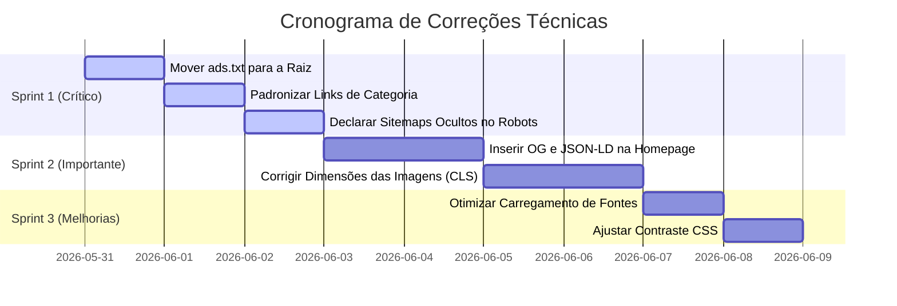

# Relatório de Auditoria de Produção — Radar de Preços

## 🎯 Resumo Executivo

Este relatório apresenta os resultados da **Auditoria de Produção** realizada no site publicado [Radar de Preços](https://radardeprecos.github.io/radar/) (hospedado no GitHub Pages). O objetivo principal foi analisar o domínio ativo e a estrutura do repositório para identificar falhas técnicas que impedem o **crescimento orgânico (SEO)**, a **indexação eficiente no Google**, a **aprovação no Google AdSense** e a **conversão de usuários**.

Diferente de relatórios de desenvolvimento que analisam apenas arquivos locais, esta auditoria foi executada diretamente contra o ambiente de produção. Foram verificadas 67 URLs listadas no sitemap principal, além de uma varredura completa na estrutura de arquivos físicos do repositório contendo 279 páginas HTML.

---

## 📊 Visão Geral dos Resultados

Abaixo está o resumo dos principais indicadores obtidos durante a auditoria técnica automatizada e manual:

| Métrica / Item Auditado | Status | Resultado | Observação |
| :--- | :---: | :---: | :--- |
| **Status HTTP das URLs do Sitemap** | 🟢 Excelente | **100% OK** (67/67) | Todas as URLs retornaram status HTTP 200 sem falhas ou timeouts. |
| **Sitemaps Adicionais** | 🟡 Atenção | **4 Sitemaps Ocultos** | Existem sitemaps gerados no repositório que não estão declarados no robots.txt. |
| **Robots.txt** | 🟢 Excelente | **Válido** | Arquivo presente e configurado corretamente em `/radar/robots.txt`. |
| **Links Internos Quebrados (404)** | 🔴 Crítico | **1 Encontrado** | O link interno para `/guias/` retorna erro 404 (página não encontrada). |
| **Páginas Órfãs Físicas** | 🔴 Crítico | **5 Páginas** | Seções de categoria importantes não recebem links internos diretos. |
| **Páginas Ocultas (Sem Index)** | 🔴 Crítico | **212 Páginas** | 75% das páginas HTML geradas no repositório estão fora dos sitemaps oficiais. |
| **Open Graph (Homepage e Categorias)** | 🔴 Crítico | **Ausente** | Faltam tags Open Graph essenciais nas páginas de entrada e categorias. |
| **Dados Estruturados (JSON-LD)** | 🔴 Crítico | **Ausente** | Sem marcação JSON-LD na Homepage e nas páginas de Categoria. |
| **Performance (LCP Mobile)** | 🟡 Atenção | **2.7s - 2.9s** | LCP classificado como "Precisa Melhorar" pelo Google devido a recursos bloqueadores. |
| **Estabilidade Visual (CLS Categoria)** | 🔴 Crítico | **0.731 (Ruim)** | Mudança de layout severa nas categorias devido à renderização dinâmica de imagens. |
| **Validação de Monetização (ads.txt)** | 🔴 Crítico | **Erro de Raiz** | O arquivo `ads.txt` está na subpasta `/radar/` e retorna 404 na raiz do domínio. |

---

## 🔴 Problemas Críticos (Ação Imediata)

Estes problemas impedem diretamente a indexação correta no Google, bloqueiam a aprovação no Google AdSense ou quebram a experiência de navegação do usuário.

### 1. Localização Incorreta do Arquivo `ads.txt` (Bloqueio do AdSense)
* **O problema:** O arquivo `ads.txt` foi publicado em `https://radardeprecos.github.io/radar/ads.txt`. No entanto, a especificação oficial do Google AdSense exige que o arquivo seja acessível **estritamente na raiz do domínio de segundo nível**: `https://radardeprecos.github.io/ads.txt`.
* **Impacto:** O Google AdSense não conseguirá validar a propriedade do site. Isso causará o status "Não encontrado" ou "Erro de autorização" no painel do AdSense, bloqueando permanentemente a monetização.
* **Solução:** Mover ou copiar o arquivo `ads.txt` do repositório `radar` para a raiz do repositório `radardeprecos.github.io`.

### 2. Páginas Ocultas e Desconexão do Sitemap (212 Páginas Invisíveis para o Google)
* **O problema:** O repositório contém **279 arquivos HTML**, mas o sitemap oficial (`sitemap.xml`) lista apenas **67 URLs**. Existem **212 páginas HTML** criadas no repositório que estão totalmente fora do sitemap.
* **Seções Ocultas Identificadas:**
  * **36 páginas de comparação** em `/comparar/` (ex: `galaxy-a36-vs-moto-g35`).
  * **43 páginas de produtos** em `/produtos/` (que retornam 404 no diretório pai, mas os arquivos físicos existem).
  * **10 páginas de Melhores do Ano** em `/melhores-2026/`.
  * **9 páginas de melhores ofertas de marcas** em `/melhores-ofertas/`.
* **Impacto:** Para o Google, estas 212 páginas simplesmente não existem. O robô de indexação não as encontrará de forma estruturada, desperdiçando o potencial de cauda longa (long-tail SEO) que essas comparações e listas trariam.
* **Solução:** Atualizar o arquivo robots.txt para referenciar os sitemaps adicionais já existentes no repositório (`sitemap-categorias.xml`, `sitemap-guias.xml`, `sitemap-produtos.xml`, `sitemap-noticias.xml`) ou unificá-los em um `sitemap_index.xml`.

### 3. Links Internos Quebrados (HTTP 404)
* **O problema:** Foi identificado um link interno quebrado apontando para `https://radardeprecos.github.io/radar/guias/` que retorna status HTTP 404.
* **Impacto:** Links internos quebrados passam um sinal de "site abandonado ou de baixa qualidade" para o algoritmo do Google, além de frustrar os usuários que clicam na navegação principal.
* **Solução:** O diretório `/guias/` físico não possui um `index.html`, apenas a subpasta `/melhor-celular-ate-1500/`. É necessário criar uma página de índice em `/guias/index.html` listando os guias de compra ativos ou corrigir o link de navegação para apontar diretamente para o guia específico.

### 4. Páginas Órfãs Reais (Zero Links Internos Recebidos)
* **O problema:** A análise de grafos de links internos revelou que **5 páginas principais** são órfãs (possuem zero links de outras páginas apontando para elas):
  * `/categorias/beleza/`
  * `/categorias/casa/`
  * `/categorias/ferramentas/`
  * `/categorias/games/`
  * `/ofertas/ferramentas/parafusadeira-furadeira-...html`
* **Causa técnica:** Os links de navegação na homepage e no cabeçalho apontam incorretamente para `/categorias/celulares/index.html` (com a extensão `.html`), enquanto as URLs canônicas e listadas no sitemap terminam com barra `/` (diretório limpo). Isso criou caminhos duplicados e isolou as URLs limpas.
* **Impacto:** O robô do Google não consegue distribuir a autoridade da página principal (Link Juice) para estas categorias. Elas demorarão meses para indexar ou nunca serão indexadas por falta de links de entrada.
* **Solução:** Padronizar todos os links internos para usar URLs amigáveis sem `index.html` (ex: `/radar/categorias/games/` em vez de `/radar/categorias/games/index.html`).

### 5. Ausência de Open Graph e JSON-LD na Homepage e Categorias
* **O problema:** Enquanto as páginas de ofertas individuais possuem tags Open Graph e JSON-LD (`Product`, `FAQPage`) completas, a **Homepage** e as **Páginas de Categoria** não possuem nenhuma marcação de dados estruturados e nenhuma tag Open Graph.
* **Impacto:**
  * Compartilhamentos da homepage no WhatsApp, Telegram, Twitter ou Facebook não exibirão imagem, título ou descrição atraentes.
  * O Google não conseguirá exibir os Rich Snippets de busca estruturada para a marca principal ou breadcrumbs para as categorias.
* **Solução:** Inserir a marcação JSON-LD do tipo `WebSite` e `Organization` na Homepage, e dados estruturados do tipo `CollectionPage` e `BreadcrumbList` nas páginas de categoria.

---

## 🟡 Avisos Importantes (Melhoria de Médio Prazo)

Estes itens afetam a experiência do usuário, a taxa de conversão e a performance do site no ranking do Google (Core Web Vitals).

### 1. Cumulative Layout Shift (CLS) Crítico nas Páginas de Categoria
* **O problema:** O relatório do Lighthouse mediu um CLS de **0.731** na página de categorias. O limite aceitável do Google é **0.10**.
* **Causa técnica:** As imagens dos produtos nas grades de ofertas são carregadas dinamicamente sem que as tags `` tenham dimensões de largura (`width`) e altura (`height`) explicitamente definidas no HTML, ou sem um esqueleto de carregamento (placeholder).
* **Impacto:** Conforme as imagens são baixadas, o conteúdo da página "pula" de forma agressiva. Isso irrita o usuário e gera penalizações severas no algoritmo de Core Web Vitals do Google para dispositivos móveis.
* **Solução:** Adicionar atributos de tamanho físico (ex: `width="200" height="200"`) ou usar classes CSS de proporção de aspecto (aspect-ratio) nas imagens dos produtos.

### 2. Recursos Bloqueadores de Renderização (Atraso no LCP)
* **O problema:** O Largest Contentful Paint (LCP) medido localmente foi de **2.7s** a **2.9s** (limite ideal é < 2.5s). O principal vilão é a presença de fontes do Google (`https://fonts.googleapis.com`) carregadas de forma síncrona no cabeçalho.
* **Impacto:** A página demora quase 3 segundos para exibir o conteúdo principal na tela do usuário em conexões 3G/4G, reduzindo a taxa de conversão de cliques em links de afiliados.
* **Solução:** Aplicar técnicas de pré-conexão (`<link rel="preconnect" href="https://fonts.gstatic.com">`) e carregar as fontes de forma assíncrona com `display=swap`.

### 3. Falhas de Contraste de Acessibilidade (WCAG)
* **O problema:** O Lighthouse apontou falhas de contraste entre o texto em cinza claro e o fundo branco na barra de estatísticas e nos cards de produtos.
* **Impacto:** Usuários com dificuldades visuais ou navegando sob luz solar direta terão dificuldades para ler as informações de preços, reduzindo o engajamento.
* **Solução:** Ajustar as cores do CSS para garantir um contraste mínimo de **4.5:1** para textos normais.

---

## 🟢 Melhorias Futuras (Oportunidades de Crescimento)

Ações recomendadas para quando a base técnica estiver 100% corrigida e o site começar a receber tráfego orgânico recorrente.

### 1. Implementação de Monitoramento de Conversão Avançado
* **Recomendação:** Atualmente o site possui apenas links estáticos. Para se tornar um verdadeiro portal de inteligência, é fundamental implementar eventos de clique no Google Analytics 4 (GA4) específicos para rastrear cliques em links de afiliados (Mercado Livre), categorizados por tipo de produto.
* **Como fazer:** Adicionar tags de rastreamento `data-affiliate-click` e disparar eventos personalizados via JavaScript contendo a categoria do produto, ID e o valor do desconto.

### 2. Criação do Painel Executivo Interno (`/admin/executivo`)
* **Recomendação:** Criar uma página administrativa estática protegida ou local que compile as métricas de performance técnica do site, status de indexação e cliques estimados. Isso ajudará a tomar decisões rápidas sobre quais categorias focar em novos backlinks.

---

## 🛠️ Plano de Ação Prático (Passo a Passo)

Para facilitar a correção rápida por parte do Manus, dividimos as correções em três sprints de prioridade:



### Instruções Técnicas para Execução no Repositório:

1. **Correção do `ads.txt`:**
   ```bash
   # No repositório radardeprecos.github.io
   cp /home/ubuntu/radar/ads.txt /home/ubuntu/radardeprecos.github.io/ads.txt
   cd /home/ubuntu/radardeprecos.github.io
   git add ads.txt && git commit -m "Fix: Adicionar ads.txt na raiz do dominio" && git push
   ```

2. **Correção do Robots.txt (Declarar sitemaps adicionais):**
   Substituir a declaração de sitemap no arquivo `/home/ubuntu/radar/robots.txt` por:
   ```text
   # Sitemaps do Portal
   Sitemap: https://radardeprecos.github.io/radar/sitemap.xml
   Sitemap: https://radardeprecos.github.io/radar/sitemap-categorias.xml
   Sitemap: https://radardeprecos.github.io/radar/sitemap-produtos.xml
   Sitemap: https://radardeprecos.github.io/radar/sitemap-guias.xml
   Sitemap: https://radardeprecos.github.io/radar/sitemap-noticias.xml
   ```

3. **Correção de Links de Categoria (Evitar Páginas Órfãs):**
   No arquivo `/home/ubuntu/radar/index.html` (e nos arquivos de template), alterar links como:
   * `categorias/celulares/index.html` para `categorias/celulares/`
   * `categorias/games/index.html` para `categorias/games/`
   *(Fazer o mesmo para todas as 8 categorias)*

---

## 📋 Conclusão

O **Radar de Preços** possui uma base de dados fantástica com centenas de páginas geradas e dados estruturados muito ricos nas páginas de ofertas individuais. No entanto, o portal está atualmente "escondendo" 75% do seu conteúdo do Google devido à falta de referências cruzadas nos sitemaps e à presença de páginas órfãs.

A correção do arquivo `ads.txt` na raiz e a unificação dos sitemaps no robots.txt são os passos mais baratos e de maior impacto que você pode dar hoje para destravar a monetização e o crescimento orgânico do portal.
